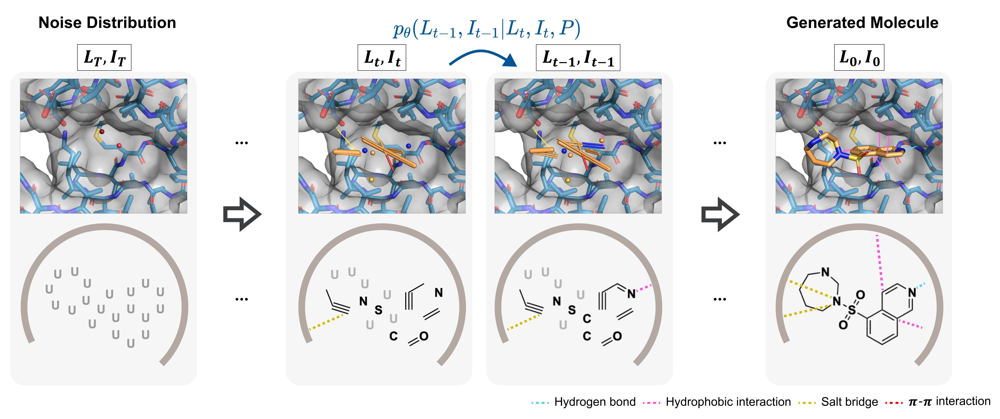

# BInD 

[](LICENSE)

This repository is the official repository for BInD (**B**ond and **In**teraction generating **D**iffusion model)

<p align="center">
   
</p>


## Setup


### Installation of Python Packages
```bash
conda create -n bind python=3.9 -y
conda activate bind

# ML
conda install  scipy=1.11.3 numpy=1.26.0 pandas=2.1.1 scikit-learn=1.3.0 -y
conda install pytorch==1.11.0 cudatoolkit=11.3 -c pytorch -y
pip install torch-scatter==2.0.9 torch-sparse==0.6.15 torch-cluster==1.6.0 torch-geometric==2.1.0.post1 -f https://data.pyg.org/whl/torch-1.11.0+cu113.html
pip install tensorboard==2.15.1

# cheminformatics
pip install rdkit==2023.9.2 
pip install biopython==1.81
conda install plip=2.3.0 -c conda-forge
conda install -c conda-forge openbabel==3.1.1
pip install meeko==0.1.dev3 scipy pdb2pqr vina==1.2.2 
python -m pip install git+https://github.com/Valdes-Tresanco-MS/AutoDockTools_py3
git clone https://github.com/durrantlab/POVME

# posecheck
pip install prolif==2.0.3
git clone https://github.com/cch1999/posecheck.git
cd posecheck
pip install -e .

# utils
pip install pyyaml==6.0.1
pip install easydict==1.13
pip install parmap==1.7.0

# plots
pip install matplotlib==3.8.1
pip install seaborn==0.13.0
```

### Download Data and Trained Checkpoints

<table>
  <tr>
    <td align="center">Data</td>
    <td align="center">Size</td>
    <td align="center">Path</td>
  </tr>
  <tr style="border-top: 3px solid black;">
    <td align="left"><a href="https://drive.google.com/uc?export=download&id=1v1wOCpkXbemU9FE3utEXrAsVjm6pvnXN">Raw data</a></td>
    <td align="right">1.7GB</td>
    <td align="left"><code>data/raw/</code></td>
  </tr>
  <tr>
    <td align="left"><a href="#">Processed data (whole)</a></td>
    <td align="right">3.7GB</td>
    <td align="left"><code>data/processed/</code></td>
  </tr>
  <tr>
    <td align="left"><a href="https://drive.google.com/uc?export=download&id=1UZwes8OF3O-CjlB1rpNzLvDyZk7qvsQA">Processed data (only test)</a></td>
    <td align="right">3.3MB</td>
    <td align="left"><code>data/processed/</code></td>
  </tr>
  <tr>
    <td align="left"><a href="https://drive.google.com/uc?export=download&id=1xPtdKN_DhvvPlE2A9V5bdwjGQY_lwfWe">Data split keys</a></td>
    <td align="right">3.3MB</td>
    <td align="left"><code>data/</code></td>
  </tr>
  <tr>
    <td align="left"><a href="https://drive.google.com/uc?export=download&id=1lA1sHkFWvmXRim_m4S2oIOF2VPsO8zMb">POVME data</a></td>
    <td align="right">0.7MB</td>
    <td align="left"><code>data/</code></td>
  </tr>
  <tr>
    <td align="left"><a href="https://drive.google.com/uc?export=download&id=17H9IBra3z9VRfSGBU4U9qNl0uO0KyU-2">Trained checkpoint</a></td>
    <td align="right">10.7MB</td>
    <td align="left"><code>save/</code></td>
  </tr>
</table>

You can download the `.tar.gz` files provided above, extract them, and place the contents in the desired directory.


## Training BInD From Scratch


### Data Preparation

```bash
python -u process.py 
```


### Training

To train BInD with the default settings, use the command below. You can adjust the training configurations by editing the `configs/train.yaml` file. 
For multi-GPU training, modify the `n_gpu` and `n_workers` parameter as needed.

**Warning:** Setting the `save_dir` parameter will overwrite the existing directory where training checkpoints are saved.

```bash
python -u train.py configs/train.yaml
```


## Genearting Molecules with BInD


### Molecule Generation for Test Pockets

```bash
python generate_test_pockets.py configs/generate_test_pockets.yaml
```


### Pocket Conditioned Molecule Generation

```bash
python generate.py configs/generate.yaml
```


## Collaborators

<table>
  <tr>
    <td align="center" style="border: none;">
      <a href="https://github.com/oneoftwo">
        
        <br />
        Lee, Joongwon
      </a>
    </td>
    <td align="center" style="border: none;">
      <a href="https://github.com/WonhoZhung">
        
        <br />
        Zhung, Wonho
      </a>
    </td>
    <td align="center" style="border: none;">
      <a href="https://github.com/SeoJisu0305">
        
        <br />
        Seo, Jisu
      </a>
    </td>
  </tr>
</table>
